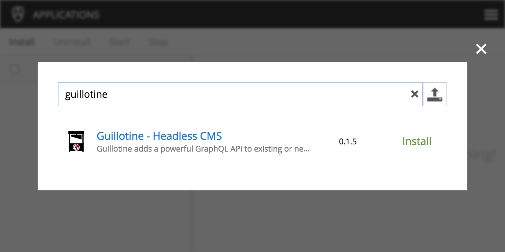
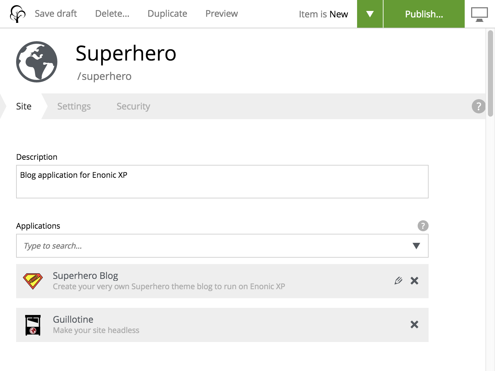

= Deployment

== Application mode 

Guillotine is available on Enonic Market as a standalone application. Once installed, the application can be added to your existing site (collection of content++) - and will instantly generate and expose an API matching your existing content. 

Follow the instructions below to get started:

=== Install app

* Open the admin tool "Applications"
* Search for the "guillotine" application
* Click on "install"

=== Configure

* Open the admin tool "Content Studio"
* Edit your site
* Add the application "Guillotine"

You now have a GraphQL endpoint!

=== Endpoint

Once installed, your endpoint will be available at a fixed location contextual to your site: /_/com.enonic.app.guillotine/graphql

Example when deployed with vhost: https://mysite.com/_/service/com.enonic.app.guillotine/graphql

Guillotine will always provide an API, URL generation, and access to content based on it's contextual site. This is explained in detail below:

== Embedded mode

By embedding Guillotine in your application you get full control over the API. This is generally the preferred approach, and is also what you get when using the https://market.enonic.com/vendors/enonic/headless-cms-starter[Headless CMS starter]

Follow the instructions below to embed Guillotine in your application:

=== Add library
     
Add the following dependency to your project (where `<version>` is the actual version of Guillotine you want to use):

.build.gradle
[source,gradle]
----
dependencies {
  include 'com.enonic.lib:lib-guillotine:<version>'
}
----

=== Creating an endpoint
 
Unlike most headless CMSs, Enonic XP is also capable of running custom code - for instance by acting as a traditional CMS. We'll make use of this capability to deploy the headless API together with our application.

When using the Guillotine library, you control where and how your API is exposed. For instance:

Service:: i.e. https://mysite.com/_/service/<app-name>/<service-name>
Mapping:: i.e. https://mysite.com/<mapping>
Filter:: i.e. https://mysite.com (GraphQL uses POST method, so it may even be combined with GET on the same URL pattern)

The various approaches are described below:

==== As a service

By using XP's web service approach, your endpoint will automatically by exposed on a safe path within your site. 

* Create an Enonic XP service file `/services/graphql/graphql.js` with the following content:
 
./services/graphql/graphql.js
[source,javascript]
----
var guillotineLib = require('/lib/guillotine'); // <1>
var graphQlLib = require('/lib/graphql'); // <1>

var schema = guillotineLib.createSchema(); // <2>

exports.post = function (req) { // <3>
 var body = JSON.parse(req.body); // <4>
 var result = JSON.stringify(graphQlLib.execute(schema, body.query, body.variables)); // <5>
 return {
     contentType: 'application/json',
     body: JSON.stringify(result)
 };
};
----
<1> Requires the Guillotine and GraphQL libraries. 
The GraphQL library is already included with Guillotine and does not need to be added to your Gradle file
<2> Creates the GraphQL schema the first time the service is called. 
<3> Handles POST requests
<4> Parses the JSON body to retrieve the GraphQL query and variables
<5> Executes the query and variables against the schema created

You now have a GraphQL endpoint!

==== As a mapping

Coming soon

==== As a filter

Coming soon
