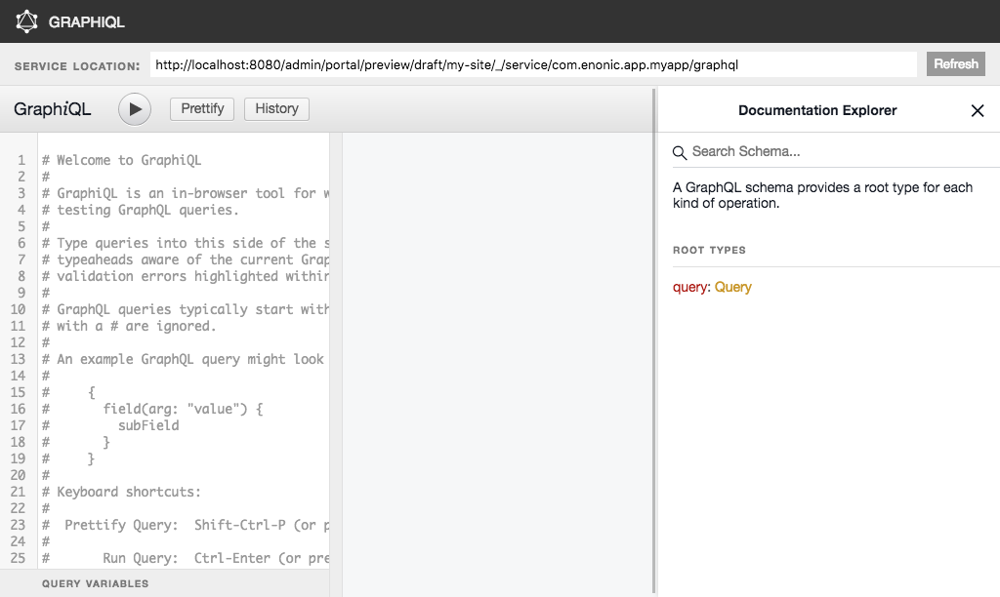
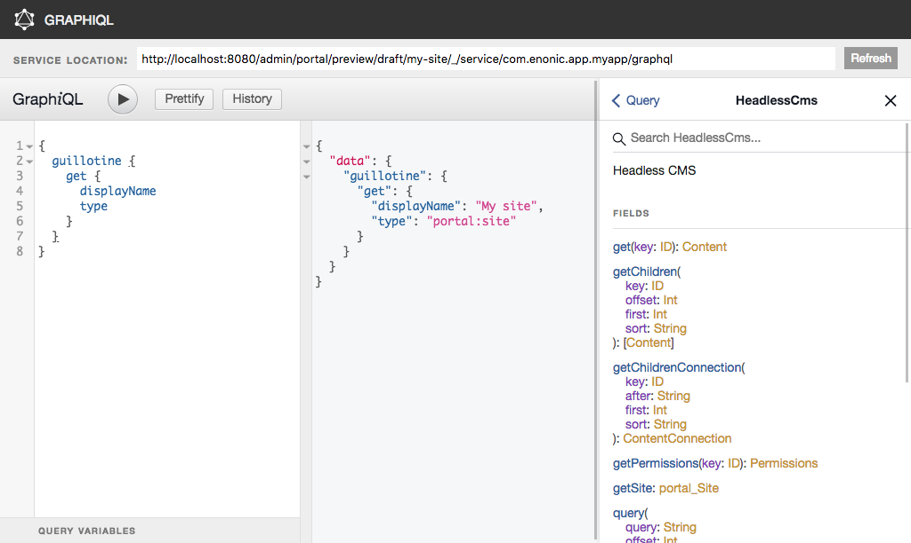

= GraphiQL

The easiest way to manually explore a GraphQL API and test GraphQL queries is to use GraphiQL

== Installation 

* Open the admin tool "Applications"
* Search for the "graphiql" application
* Click on "install"
* Open the admin tool "GraphiQL"

== User Interface

* The field 'Service Location' specifies the location of the GraphQL service. 
+
By default, it is prefilled with one of your configured sites for the branch "draft".
* The left panel allows you to edit your graphQL query
* The center panel displays the result of the query execution
* The right panel is used to display a documentation generated from the GraphQL API.

== Usage example

* Write the query below inside the left panel.
+
This query can be read as: Retrieve the display name and type of the current content.
* Click on the query execution button above
* The service response is displayed in the center panel

----
{
  guillotine {
    get {
      displayName
      type
    }
  }
}
----

