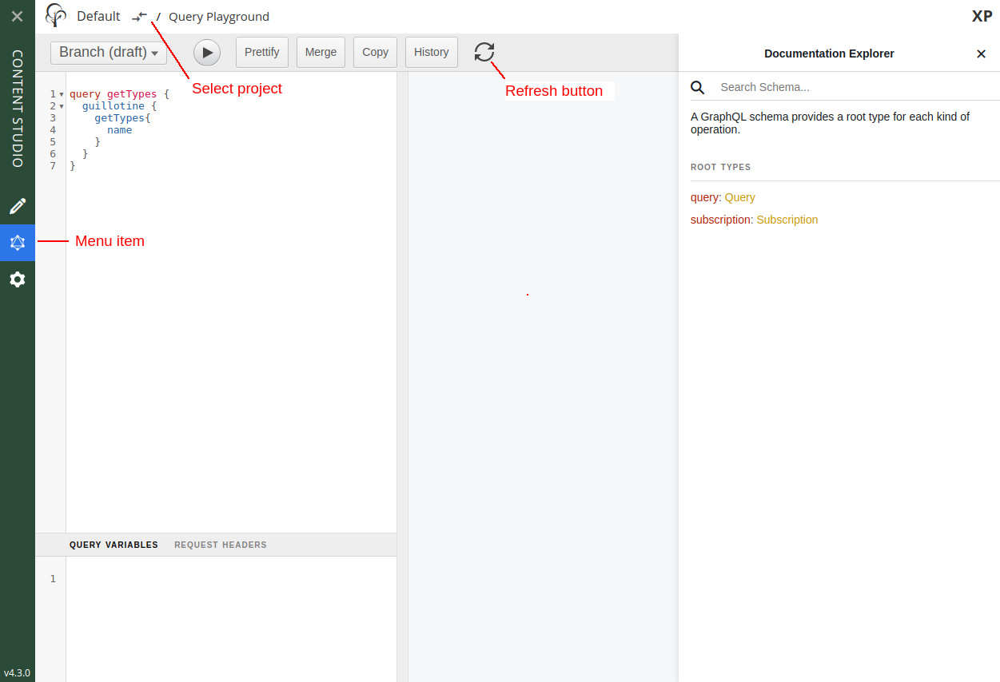

= Query Playground

This section describes how access and use the API via the Content Studio extension

== About GraphQL

GraphQL is a query language developed by Facebook.
Compared to RESTful APIs, GraphQL is strongly typed and self-documented. It also enable client developers to request exactly the information required in as few requests as possible.

http://graphql.org/learn[Learn more about GraphQL...]

== Content Studio extension

After installing Guillotine, Content studio automatically gets a new menu item called `Query playgroud`. This is currently only accessible for users with `system.admin` or `cms.admin` roles.

Using the `Query playground` you may run queries against the contextual project content. You may choose to query either the draft items (draft branch), or the published items (master branch).

* The left panel allows you to edit your GraphQL query
* The center panel displays the result of the query execution
* The right panel is used to display a documentation generated from the GraphQL API.
* The toolbar is extended by the dropdown for choosing the branch and the refresh button, which allows to re-generate a schema
* Each query is executed in a specific context, which is determined by the repository and the branch

=== Queries

* Write the query below inside the left panel.
+
This query can be read as: Retrieve the display name and type of the current content.
* Click on the query execution button above
* The service response is displayed in the center panel

TODO: Replace, no longer relevant

.getSite
[source,graphQL]
----
{
  guillotine {
    getSite {
      displayName
      type
    }
  }
}
----

=== Subscriptions

Guillotine also enables you to use GraphQL subscription in order to listen to events from the server.

The subscriptions are implemented using Websockets, providing instant and high performance streaming of events over HTTP.

[source,graphQL]
.Listen to server events for the specific site
----
subscription {
  event {
    type
    dataAsJson
  }
}
----

Just like for regular queries, Guillotine listens to events only for the contextual repository and branch

== API introduction

At the root of the default Guillotine schema is a type `Query` with a field `guillotine` of type `HeadlessCms`.
The `HeadlessCms` type gathers fields allowing to retrieve content or related data.

=== Content

The type `Content` is an interface with multiple implementations generated from built-in content types, but also from content types defined by your application.

All types implementing `Content` share the same fields at the exception of the field `data` defined for each implementation type.

=== Relations

Relations between content items are provided as fields, allowing you to traverse and extract content through structures.

By default, each content items has the following relations:

* parent: Link to the parent content
* children: Link to the child contents

Moreover, every ContentSelector, MediaSelector or ImageSelector defined in your schemas will be converted to a link to the related item(s).

.Query example: Retrieve the display name of the current content and the display name of its direct children
----
{
  guillotine {
    get {
      displayName
      children {
        displayName
      }
    }
  }
}
----

.Query example: Retrieve the blog posts. For each post, return its display name and the display name of the related author
----
{
  guillotine {
    query(contentTypes:"com.enonic.app.myapp:post") {
      displayName
      ... on com_enonic_app_myapp_Post {
        data {
          author {
            displayName
          }
        }
      }
    }
  }
}
----

=== Images

Enonic XP can dynamically render images at runtime. Guillotine uses this functionality by providing the field "imageUrl", which will generating a URL for the desired image size and crop.

.*Example: Scaled Image URL* - Retrieve the image contents and generate absolute URLs to these images cropped to 800x200px
----
{
  guillotine {
    query(contentTypes:"media:image") {
      displayName
      ... on media_Image {
        imageUrl(scale:"block(800,200)",type:absolute)
      }
    }
  }
}
----

=== Rich text

Rich text fields are generated with a parameter "processHtml" allowing control the output resulting links and much more.

.*Example: Process HTML* - Retrieve the blog posts. For each post, return its author display name, tags and processed content.
----
{
  guillotine {
    query(contentTypes:"com.enonic.app.myapp:post") {
      ... on com_enonic_app_myapp_Post {
        data {
          author {
            displayName
          }
          tags
          post(processHtml:{type:absolute}) {
             raw
             processedHtml
          }
        }
      }
    }
  }
}
----

More details about <<rich-text#,Rich text processing>>.