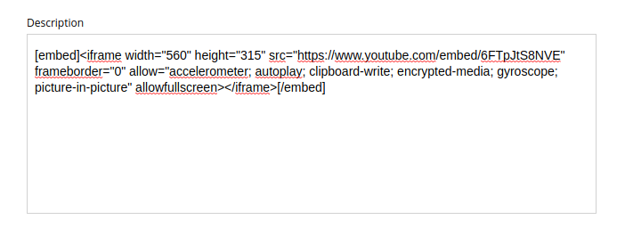
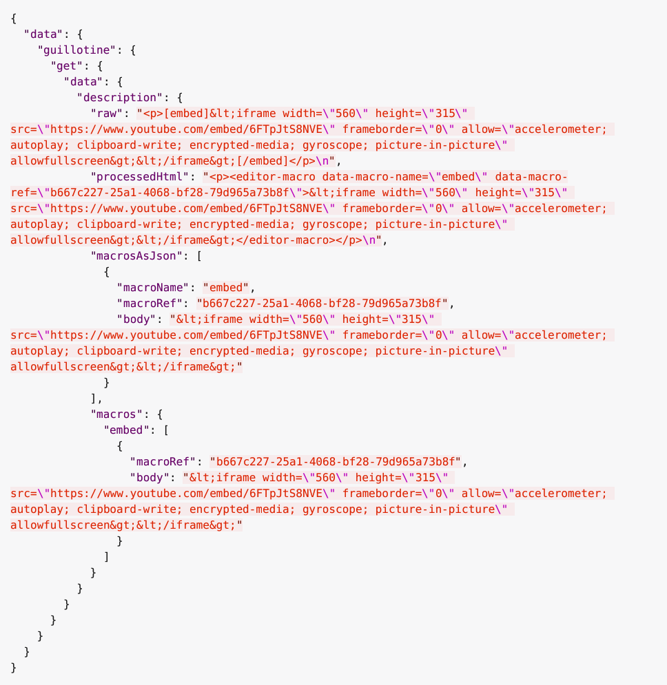
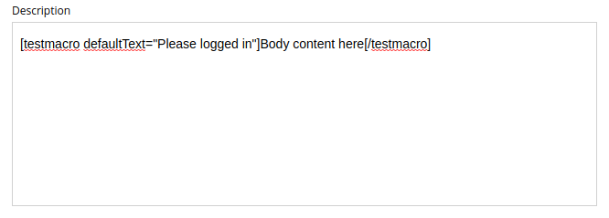

= Rich text processing

 The default Guillotine HTML editor type provides processing of macros and image source URLs in the `processedHtml` field of the <<api#richtext, RichText>> GraphQL object type.
But you might want to have custom processing of macros and images, for that you can use `macrosAsJson`, `macros` and `images` fields of the <<api#richtext, RichText>>.

== Usage

=== Links

TODO

=== Images

Starting from  Guillotine by default provides image processing in the `processedHtml` field of the <<api#richtext,RichText>> GraphQL object type. All internal links to resources will be replaced by `server` or `absolute` link and for each `img` tag will be added the `data-image-ref`.
Using that reference you will be able to find a image details in the `images` field and to do a custom image processing if needed.

For instance, the processed value of an image looks like as below:

[source,html]
----
<figure class="editor-align-justify">
    
    <figcaption>Caption text</figcaption>
</figure>
----

The query below will process images inside the field:

[source,graphql]
----
query {
  guillotine {
    get(key: "contentID") {
      ... on com_app_example_ContentType {
        data {
          htmlAreaField {
            images {
              ref                           // <1>
              image {                       // <2>
                ... imageFragment
              }
              style {                       // <3>
                name
                aspectRatio
                filter
              }
            }
          }
        }
      }
    }
  }
}

fragment imageFragment on Content {
  _id
  type
  ... on media_Image {
    data {
      caption
    }
  }
  ... on media_Vector {
    data {
      caption
    }
  }
}
----
<1> Reference to image in the processedHtml field
<2> Image as <<api#content, Content>> type
<3> Image style as <<api#imagestyle, ImageStyle>> type

Using the `processHtml` argument which has <<api#processhtmlinput, ProcessHtmlInput>> type for a form item of type `HtmlArea` or for
`TextComponent` field you can specify `imageWidths` to generate relevant links for specific widths of an image.
In this case `srcset` attribute will be added to `img` tags.

For instance, when using the following fragment of query:

[source,graphql]
----
htmlAreaField(processHtml: { imageWidths: [600, 992] }){
    processedHtml
    images {
      ref
    }
}
----

The result will look as follows:

[source,html]
----
<figure class="editor-align-justify">
    
    <figcaption>Caption text</figcaption>
</figure>
----

=== Macros

Each macro will be translated to an `editor-macro` tag with `data-macro-ref` and `data-macro-name` attributes in the `processedHtml` field value. Using these references you will be able to find details of a specific macro in the `macrosAsJson` or `macros` fields and perform custom macro processing if needed.

[NOTE]
====
Guillotine processes macros which have a descriptor and built-in macros called `disable` and `embed`, otherwise processing will be skipped. More details about macros https://developer.enonic.com/docs/xp/stable/cms/macros[here].
====

For instance, we have an input form item called `description` of `HtmlArea` type which contains the `embed` macro as shown below:

The query below will fetch data for the `description` field:

[source,graphql]
----
query {
  guillotine {
    get(key: "contentID") {
      ... on com_app_example_ContentType {
        data {
          description {
            raw            // (1)
            processedHtml  // (2)
            macrosAsJson   // (3)
            macros {       // (4)
              ref
              name
              descriptor
              config {
                embed {
                  body
                }
              }
            }
          }
        }
      }
    }
  }
}
----
<1> Non-processed value of the `description` field
<2> Processed value of the `description` field
<3> Array of processed macros in JSON format. The order of macros will be the same as in the `raw` and `processedHtml` fields.
<4> <<api#macro, Macro>> allows to specify necessary fields. That field is an alternative for `macroAsJson` field

Results of the query:

It is common to define a  https://developer.enonic.com/docs/xp/stable/cms/macros#descriptor[schema for your macro]. This is located in the `/site/macros/` directory. For instance, for a macro with name `testmacro` the schema will be placed by the following path `/site/macros/testmacro/testmacro.xml`

[source,xml]
----
<macro>
  <display-name>Current user</display-name>
  <description>Shows currently logged user</description>
  <form>
    <input name="defaulttext" type="TextLine">
      <label>Text to show if no user logged in</label>
    </input>
  </form>
</macro>
----

Executing the query below will give your the value of the `defaulttext` input, as defined in the above schema.

[source,graphql]
----
query {
  guillotine {
    get(key: "contentID") {
      ... on com_app_example_ContentType {
        data {
          description {
            macros {
              ref
              name
              descriptor
              config {
                testmacro {
                  defaultText
                }
              }
            }
          }
        }
      }
    }
  }
}
----
